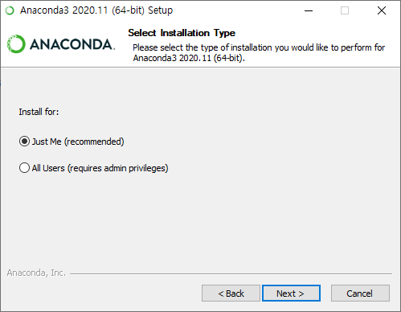
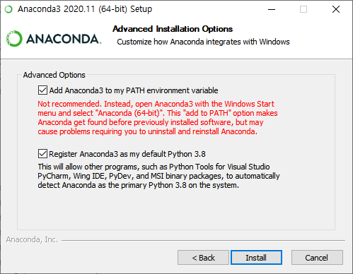
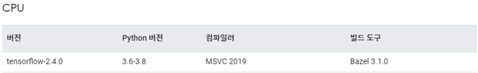
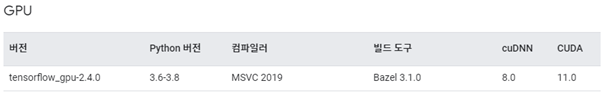
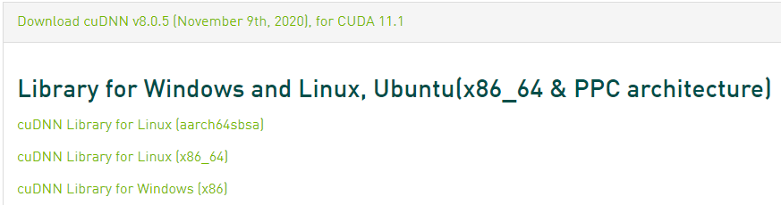
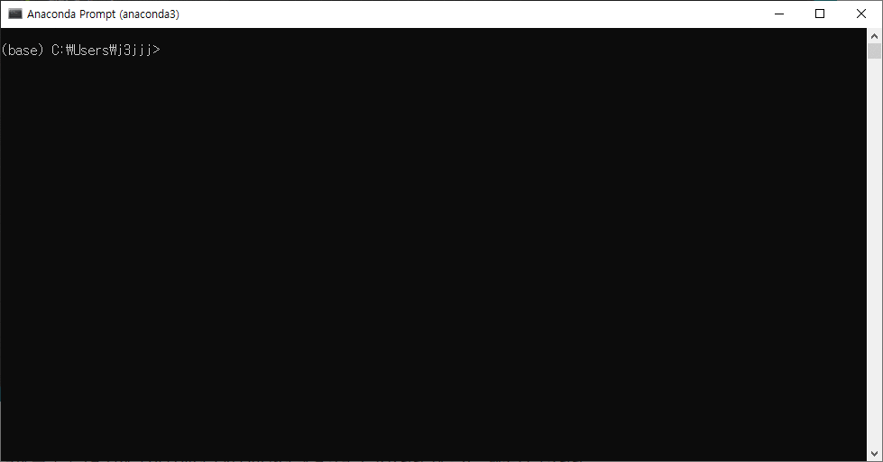
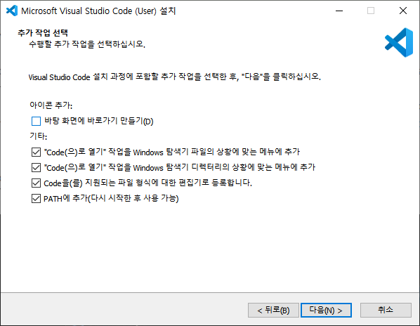
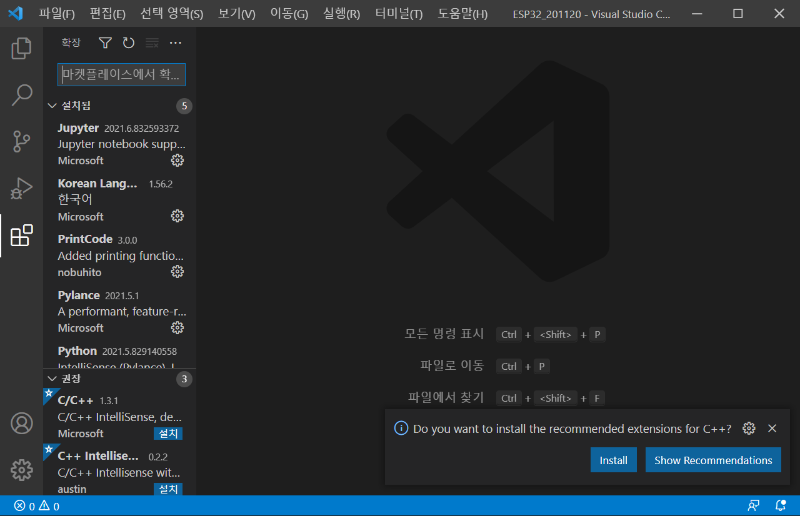

## 2021.05.13기준
## 설치 순서
1. [Anaconda](#Anaconda)
2. [CUDA](#CUDA)
3. [cuDNN](#cuDNN)  
  (외장 그래픽카드가 없다면 2, 3과정은 무시)
4. [modules](#modules)
5. [VSCode](#VSCode)
  
  
## Anaconda
1. https://www.anaconda.com/ 에서 본인 OS에 맞는 프로그램을 다운
2. Just Me (recommended) 선택  

3. Add Anaconda to my PATH environment variable(다른 python interpreter를 사용한다면 선택 해제), Register Anaconda as my default Python 3.7 선택    

  
---
CUDA, cuDNN을 설치하기 앞서 각 버전은  
Windows:  https://www.tensorflow.org/install/source_windows#tested_build_configurations  
Mac / Linux: https://www.tensorflow.org/install/source#tested_build_configurations  
에서 확인이 가능하며, (2021.05.13)기준 최신 버전을 설치  
  
  

---
        
## CUDA
https://developer.nvidia.com/cuda-toolkit-archive 에서 자신에게 맞는 버전을 선택    
여기서는 CUDA 11.1 버전을 사용  
NVIDA CUDA Toolkit 11.1 Update 1 Downloads 링크: https://developer.nvidia.com/cuda-11.1.1-download-archive?target_os=Windows&target_arch=x86_64  
자신의 OS에 맞게 다운 후 빠른 설치

## cuDNN
tensorflow 버전과 호환되면서 CUDA와 호환되는 버전의 cuDNN을 선택해야한다.(cuDNN은 로그인해야 다운로드 가능)  
1. https://developer.nvidia.com/rdp/cudnn-archive 에서 자신에게 맞는 버전을 선택
여기서는 cuDNN 8.0.5 버전을 사용  
  
자신의 OS(Windows, Linux)에 맞는 cuDNN Library for Linux (x86_64) 또는 cuDNN Library for Windows (x86) 다운  
2. 압축폴더 안에 cuda폴더를  C:\Program Files\NVIDIA GPU Computing Toolkit\CUDA\v11.1(버전에 따라 이름이 바뀜)안에 bin, include, lib 폴더를 덮어씌운다.  
3. C:\Program Files\NVIDIA GPU Computing Toolkit\CUDA\v11.1(버전에 따라 이름이 바뀜)\bin폴더 안에 있는 cusolver64_11.dll을 cusolver64_10.dll 으로 이름을 바꿔준다.

## modules
tensorflow, matplotlib등 세미나에 사용하는 모듈을 설치  
1. anaconda prompt에서 원하는 폴더로 이동하는 방법
(예를 들어 C:\Users\j3jjj에서 C:\Users\j3jjj\Desktop\pj\딥러닝 세미나로 이동하는 법)


---
cd .. : 이전으로 이동  
cd [원하는 폴더명] : 원하는 폴더로 이동  
dir : 현재 디렉토리의 폴더, 파일 리스트  

---
2. anaconda prompt에서 다음과 같이 입력(git 설치)
```
conda install git
```
3. anaconda prompt에서 다음과 같이 입력(강의자료 다운)
```conda install git
git clone https://github.com/leehuido-git/Deep-learning-seminar.git
```
4. Deep-learning-seminar폴더로 1번과 같이 이동 후 다음과 같이 입력(requirements.txt의 모듈 설치)
```
pip install -r requirements.txt
```
5. 설치가 제대로 됐는지 확인
```python
import tensorflow
print(tensorflow.__version__)
```
tensorflow version확인(2.4.1)
```python
from tensorflow.python.client import device_lib
print(device_lib.list_local_devices())
```
tensorflow가 CPU, GPU로 동작하는지 확인할 수 있으며 GPU인 경우 name: "/device:GPU:0"이 있으면 제대로 동작

## VSCode
1. https://code.visualstudio.com/download 에서 본인 OS에 맞는 프로그램을 다운  
2. 다음과 같이 설정 후 이어서 설치  
  
3. 실행 후 좌측 Marketplace에서 아래를 각각 검색하여 설치
  

---
python : python을 사용하기 위해서  
Pylance : 가독성과 모듈등 자동완성  
indent-rainbow : 가독성을 높여줌

---
  